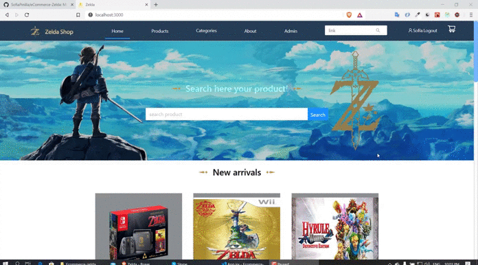
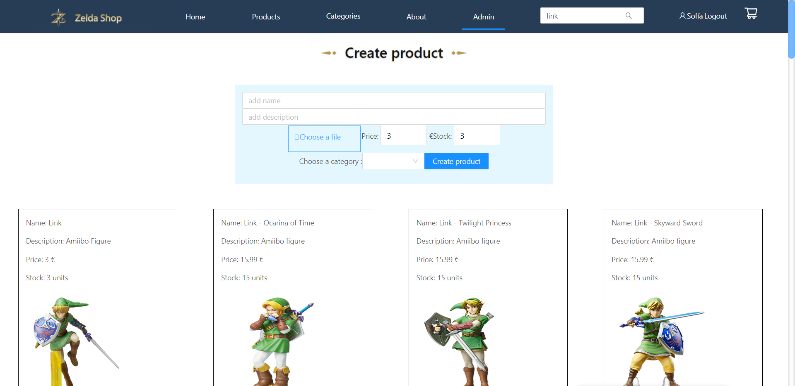

# eCommerce-Zelda
Mi Ecommerce de Zelda
Este proyecto es un ecommerce de The Legend of Zelda, en el cual puedes buscar productos, guardarlos en tu lista de deseos, comentar, 
comprar,etc. Además si eres administrador puedes acceder a la vista admin donde creas, editas y borras productos.

## Tecnologías que he utilizado 🛠️

>Mi ecommerce esta creado en MERN Stack(MongoDb, Express,React,NodeJS) y con MongoDB(mongoose) en el backend.

 ---

#### Preview

 

 

Vista admin, donde puedes crear, editar y borrar productos.

 
---

---
Hecho por [Sofía Pinilla](https://github.com/SofiaPinilla) 😊
